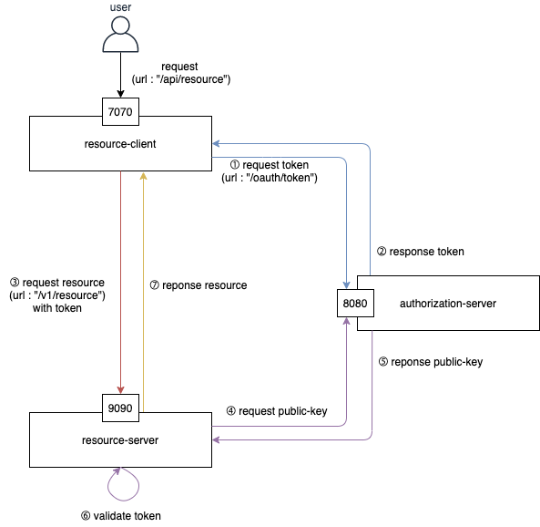
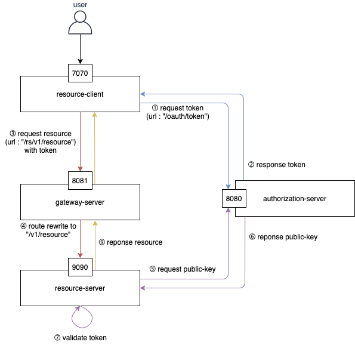
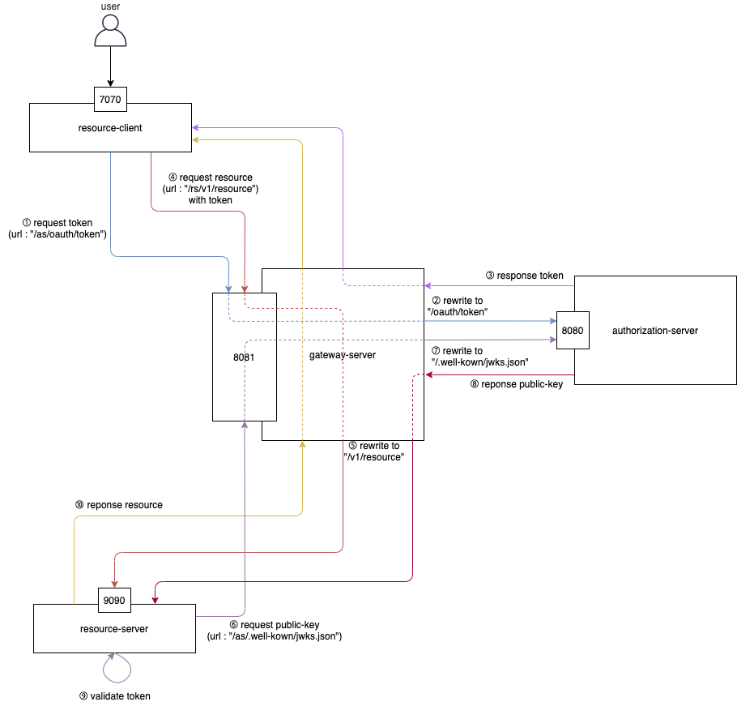

# A Tutorial Project for Authentication/Authorization process for Microservices 
This toy project will give you simple examples for Server-side Authentication and Authorization.
All application modules uses SpringBoot 2.2+, SpringSecurity 5.2+, Webflux for Resource server/client, and so on.
Programming language is Kotlin, and source will be compiled to JDK11 compatible.
 
This project provides...

* Authorization Server 
    * **JWT token** based OAuth2 Authorization based on password / client_credential grant type
    * **Dynamic** Authorization Client Details Registration with JDBC Datasource
    * **Dynamic** request authorization with [AuthorizationChecker](authorization-server/src/main/kotlin/com/bory/tutorial/oauth2/authorizationserver/config/AuthorizationChecker.kt)
    * **Asymmetric key** based JWT Token Creation/Validation
    * JwkSet endpoint 
* Resource Server
    * **Reactive** Resource server (Webflux)
    * **JWK** based token validation
    * Webflux Security enabled *partially*
* Resource Client
    * **YML** based Oauth2 client registration
    * **YML** based Authorization provider registration
    * **client_credentials** base token acquisition
* Some other stuffs
    * Multi modules gradle project with gradle-kotlin
    * Mapstruct configuration for gradle-kotlin [from mapstruct examples](https://github.com/mapstruct/mapstruct-examples/tree/master/mapstruct-kotlin-gradle)

## Initial Project Settings
This project needs Relational Database for Authorization Server (only). 
You can use docker-compose.yml file to startup MySQL database with script below.

### Startup MySQL docker container and create database
```shell script
## To run this command, docker runtime should be installed on your laptop.
docker-compose up -d
```
After docker-compose starts up MySql57 container, run the command below to create a new database named "authserver".
```shell script
docker exec -it mysql57 mysql -uroot -proot
mysql> CREATE DATABASE authserver DEFAULT CHARACTER SET utf8mb4 COLLATE utf8mb4_unicode_ci;
``` 

For more information, check the README.md files in sub modules.
* [Authorization Server README.md](authorization-server/README.md)
* [Resource Server README.md](resource-server/README.md)
* [Resource Client README.md](resource-client/README.md)

## Service Architecture

### Phase 1 - General OAuth2 Architecture



### Phase 2 - OAuth2 Architecture with Gateway 

In this phase, there is only one route configure with the resource-server as the "/rs/**" path.  



### Phase 3 - OAuth2 Architecture with Gateway

In this phase, all services are route configured and communicate only through the gateway-server.



## References
* https://docs.spring.io/spring-security-oauth2-boot/docs/current/reference/html/boot-features-security-oauth2-authorization-server.html
* https://www.baeldung.com/spring-security-oauth-dynamic-client-registration
* https://howtodoinjava.com/spring-boot2/oauth2-auth-server/